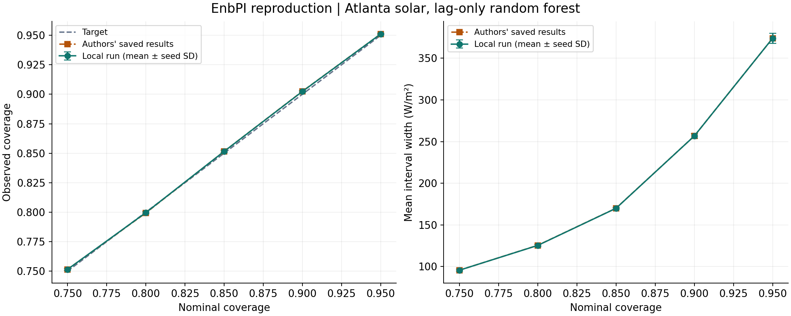
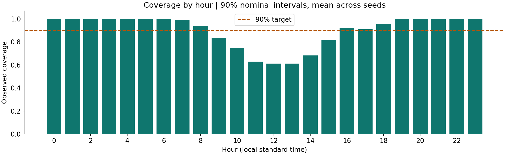
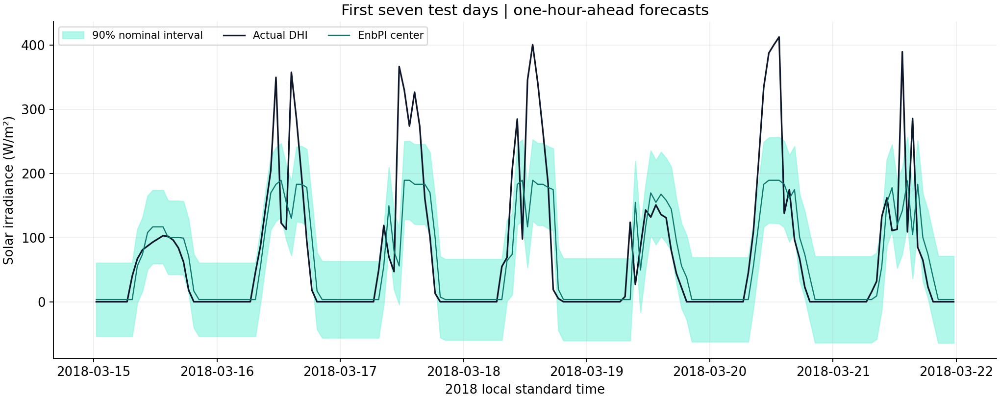
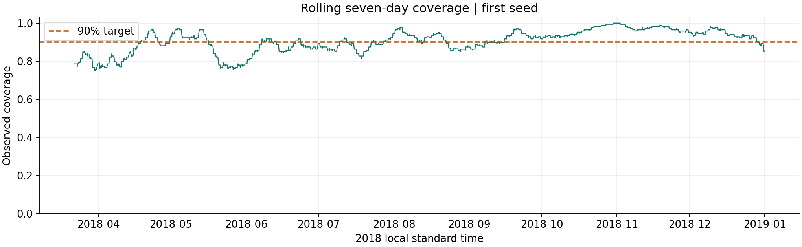

# EnbPI solar reproduction results

**Selected reproduction: ten seeds, five nominal levels.** This is the lag-only random-forest subset of Figure 1, not a reproduction of the entire paper.

## Main result

At 90% nominal coverage, local intervals covered **90.24%** of test outcomes on average, versus **90.25%** in the authors' saved CSV. Mean interval width was **256.64 W/m²** versus **256.66 W/m²** upstream. These are computed results, not values read from a plotted line.

| Target | Local coverage | Upstream coverage | Difference (pp) | Local width | Upstream width |
| --- | --- | --- | --- | --- | --- |
| 0.7500 | 0.7515 | 0.7515 | -0.0043 | 95.6299 | 95.6187 |
| 0.8000 | 0.7996 | 0.7993 | 0.0257 | 125.3687 | 125.4739 |
| 0.8500 | 0.8515 | 0.8516 | -0.0029 | 169.8749 | 169.9679 |
| 0.9000 | 0.9024 | 0.9025 | -0.0128 | 256.6359 | 256.6606 |
| 0.9500 | 0.9511 | 0.9511 | -0.0029 | 373.8992 | 373.8751 |

## What was run

- 8760 hourly observations; 1752 raw training observations, 1732 effective lagged training examples, and 7008 test observations.
- Test period: 2018-03-15 00:30:00 through 2018-12-31 23:30:00 (dataset local standard time).
- 20 past targets per forecast; 30 bootstrap forests, 10 trees each, maximum depth 2.
- 10 seeds; 5 nominal levels; one-hour feedback; no refitting during the test period.
- Sources pinned to commit `60cd5b7530eb954b02ae94da967111f5b5c3c01b` and verified by SHA-256 before the run.

See `config.json`, `run_metadata.json`, `metrics_by_trial.csv`, and `upstream_comparison.csv` for the complete audit trail. Each seed/alpha pair has a compressed CSV in `predictions/` with timestamps, actuals, centers, bounds, and coverage indicators.

## Interpretation

Observed overall coverage is not a guarantee of equally good coverage at every hour. The hourly plot is a diagnostic, and seed variation is not a confidence interval for coverage on new years or cities.

A frozen-residual diagnostic uses the same centers but never updates the initial error distribution. At the 90% target its observed coverage was 79.55%, with mean width 117.34 W/m². This is an additional experiment, not a method reproduced from Figure 1.

## Differences and limitations

- Modern Python, NumPy, and scikit-learn replace the original software environment. Numerical/seed results can differ from the authors' historical saved CSV.
- The local algorithm is tested against selected unchanged upstream methods in the same current environment; that verifies code parity, not historical bitwise reproducibility.
- The forest loss name changes from `mse` to `squared_error`; fitting uses one worker. Alpha-specific centers and the original percentile convention are retained.
- Forests are fitted once per seed and reused across alpha values because the upstream wrapper resets the same seed before each alpha run. No outcome-dependent tuning is performed.
- Intervals remain unbounded and may include negative irradiance. Bounds are not clipped in this reproduction.
- The same test period is evaluated under each seed. Repeated seeds do not add independent temporal observations.
- Retail demand, longer forecast horizons, inventory decisions, and the original neural-network/ARIMA experiments have not been evaluated.

## Attribution

Xu and Xie (ICML 2021), [Conformal prediction interval for dynamic time-series](https://proceedings.mlr.press/v139/xu21h.html). Upstream implementation: [hamrel-cxu/EnbPI](https://github.com/hamrel-cxu/EnbPI). Local scope and compatibility notes are in `../../docs/reproduction-notes.md`.
